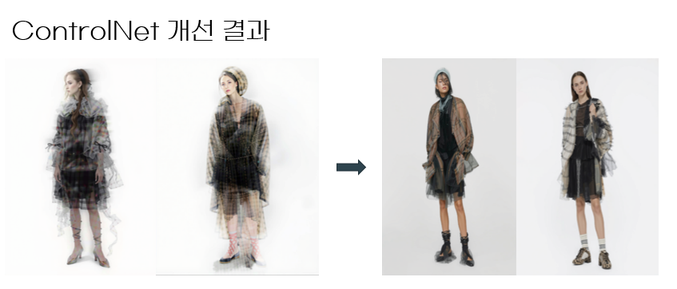
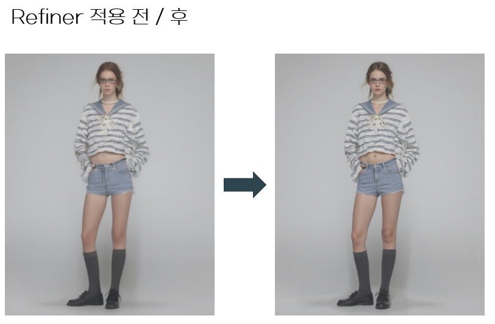
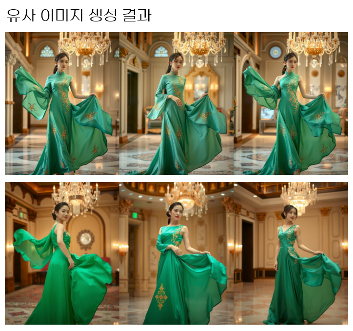

# 이미지 생성 서비스 파이프라인 설계 및 클라우드 운영

> 바이스벌사 | AI Engineer (정규직) | 2024.11 ~ 현재

## 한 줄 요약

이미지 생성 모델(FLUX)의 파이프라인 설계, LoRA/ControlNet 통합, 양자화 최적화, 클라우드 배포까지 전 과정을 담당, 논문 및 코드 분석 기반으로 서비스 수준의 문제를 해결

---

## 1. ControlNet 적용 시 이미지 번짐 해결

### 1-1. 문제 정의

- LoRA(스타일 제어)와 ControlNet(구도 제어)을 동시에 적용했을 때 생성 이미지에 번짐 현상이 발생  

### 1-2. 가설 수립

- ControlNet이 디노이징 전 과정에 개입하면서 LoRA가 주입하는 스타일 정보와 충돌하는 것이 원인이라고 판단  
- SDXL에서 Refiner가 후반 스텝에서 디테일을 보정하는 구조를 참고하여, ControlNet의 적용 단계를 제한하고 이후 Refine 단계를 추가하면 번짐을 해소할 수 있을 것이라는 가설을 수립

### 1-3. 실행 및 검증

- 오픈소스 파이프라인 코드를 분석하여 ControlNet 적용 구간을 조절할 수 있는 변수를 추가
- Refine 기능을 파이프라인에 직접 구현하여, ControlNet 적용 후 후반 스텝에서 이미지를 보정하는 구조로 수정
- ControlNet 적용 비율(전체 스텝 중 몇 %까지 적용할지)을 변경하며 생성 결과를 비교

### 1-4. 결과

- 스타일(LoRA)과 구도(ControlNet)를 동시에 적용한 고품질 이미지 생성이 가능해짐
- 번짐 현상이 해소되어 서비스에 해당 기능을 적용

---

## 2. FLUX Refiner 자체 구현

### 2-1. 문제 정의

- 다중 LoRA(2개 이상의 스타일)를 동시에 적용할 때 이미지 품질이 저하되는 문제가 발생했습니다. SDXL에서는 Refiner 모델이 존재하여 이를 보정할 수 있었으나, 당시 hugginface 라이브러리에 FLUX에는 Refiner가 존재하지 않음

### 2-2. 가설 수립

- SDXL Refiner의 동작 원리를 분석한 결과, 첫 번째 모델이 생성한 Latent를 두 번째 모델에 입력하여 디테일을 보정하는 구조임을 확인  
- FLUX에서도 동일한 원리로, 1차 생성된 Latent를 다시 입력하여 노이즈 제거 스텝을 추가하면 품질 저하를 보정할 수 있을 것이라고 판단

### 2-3. 실행 및 검증

- SDXL Refiner의 Latent 전달 방식을 분석
- FLUX 파이프라인에 Latent 입력 기반 Refiner 단계를 직접 구현
- 다중 LoRA 적용 시 Refiner 적용 전/후 이미지 품질을 비교

### 2-4. 결과

- 여러 스타일 조합 요청에도 품질 저하 없이 대응 가능
- FLUX에 존재하지 않던 기능을 자체 구현하여 서비스에 적용

---

## 3. 유사 이미지 생성 기능 구현

### 3-1. 문제 정의

- 사용자가 마음에 드는 생성 이미지를 기반으로 유사한 변형 이미지를 빠르게 생성하는 기능이 필요했으나 기존 img2img 방식(SDXL 등에서 사용)이 FLUX의 Flow Matching 기반 스케줄러와는 구현 방식이 달라 그대로 적용할수 없었음

### 3-2. 가설 수립

- FLUX의 스케줄러가 기존 DDPM/DDIM 계열과 다른 Flow Matching 방식을 사용하기 때문에, 기존의 noise 주입 방식이 호환되지 않는 것이 원인이라고 분석  
- 관련 논문 및 코드를 분석하면, 스케줄러의 noise 제어 로직을 수정하여 입력 이미지에 부분적 noise를 주입하는 방식으로 구현할 수 있을 것이라 판단

### 3-3. 실행 및 검증

- FLUX 스케줄러(Flow Matching)의 동작 원리를 논문 및 코드 레벨에서 분석
- 파이프라인의 스케줄러 코드를 수정하여, 입력 이미지에 제어 가능한 수준의 noise를 주입하는 기능 구현
- noise 강도(strength) 파라미터를 조절하며 원본과의 유사도 변화를 확인

### 3-4. 결과

- 입력 이미지 기반으로 다양한 변형 이미지를 빠르게 생성 가능
- 사용자가 strength 값을 조절하여 원본과의 유사도를 제어할 수 있는 기능 제공

---

## 4. 양자화를 통한 추론 비용 절감

### 4-1. 문제 정의

- 생성 모델을 SDXL에서 FLUX로 교체하면서 모델 크기가 크게 증가하여 추론 비용이 상승(L4 > A100)  
- 서비스 운영 비용을 절감하기 위해 품질 손실 없는 양자화 방식을 찾음

### 4-2. 가설 수립

- FLUX 모델은 Text Encoder, Transformer, VAE 등 여러 컴포넌트로 구성되어 있으며, 각 컴포넌트별로 용량이 다름  
- 양자화한 뒤 LoRA를 동적으로 적용, 해제 할 수 있어야하고 refiner를 적용할 수 있어야 함

### 4-3. 실행 및 검증

- 양자화 라이브러리 3종(optimum-quanto, bitsandbytes, torchao)을 비교 실험
- 각 라이브러리별로 컴포넌트 단위(Text Encoder, Transformer) 양자화 적용 후 생성 품질 및 추론 속도 측정
- LoRA 동적 로딩(hot-swap) 호환성 테스트
- optimum-quanto INT8이 Text Encoder에 적용 시 품질 손실 최소 + LoRA hot-swap 호환 가능한 최적의 조합임을 확인

### 4-4. 결과

- optimum-quanto INT8을 Text Encoder 2에 적용하는 방식을 최적 방식으로 선정
- 추론 비용 절감과 LoRA 호환성을 동시에 확보
- 양자화 실험 결과를 문서화하여 팀 내 공유

---

## 5. NSFW 필터링 모델 최적화

### 5-1. 문제 정의

- 기존 NSFW 필터링 모델의 정확도가 55%로, 부적절한 이미지가 필터링되지 않거나 정상 이미지가 차단되는 문제가 발생

### 5-2. 실행 및 검증

- NSFW 분류에 특화된 오픈소스 모델 8종을 수집
- 서비스에서 실제 발생하는 이미지 유형(패션, 인물, 풍경 등)을 반영한 테스트 세트 구성
- 각 모델의 정확도, 추론 속도, 제일 문제가 되었던 Recall 수치를 비교

### 5-3. 결과

- 최적 모델 선정으로 NSFW 필터링 정확도 55% → 93% 달성 (38%p 향상)
- 서비스 신뢰도 개선

