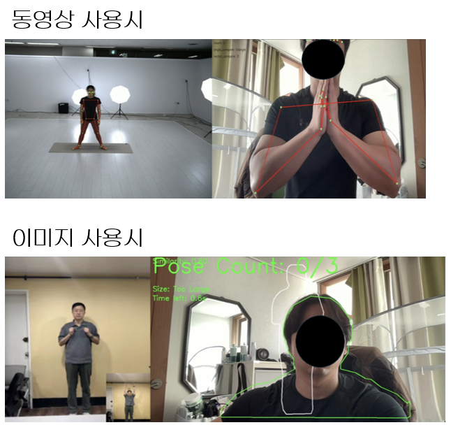
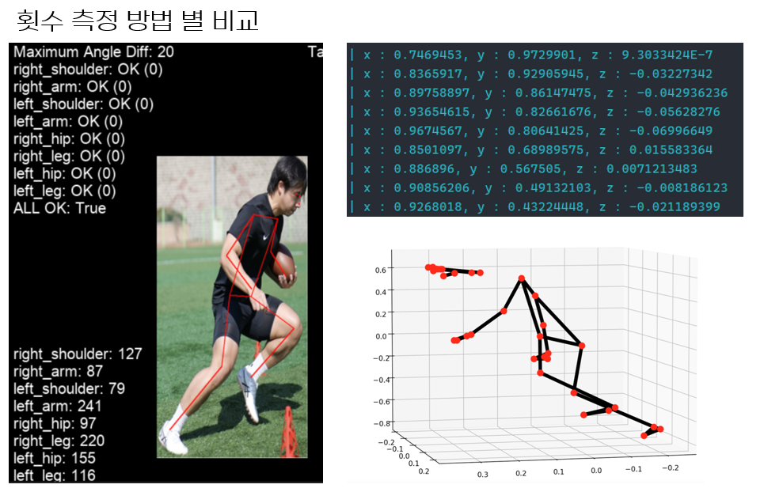

# 실시간 자세 추정 및 운동 카운팅 시스템

> 팀 프로젝트 | 2024.06

## 한 줄 요약

웹캠 기반 실시간 자세 추정 시스템을 개발하고, 프레임 최적화(FPS 624% 향상)와 3D 좌표 기반 정확도 개선을 통해 다인 환경에서도 안정적으로 동작하는 운동 보조 시스템을 구현

---

## 1. 실시간 출력 프레임 최적화

### 1-1. 문제 정의

- 사용자가 웹캠으로 자신의 운동 자세를 실시간으로 확인해야 하는데, 자세 추정 모델의 추론 속도로 인해 화면 출력에 딜레이가 발생  
- 사용자가 자연스럽게 따라 할 수 있으려면 최소 30FPS 이상이 필요하지만 초기 구현에서는 약 11FPS에 불과함

### 1-2. 가설 수립

프레임 저하의 원인이 단일 요인이 아닐 수 있다고 판단하여, 다음 가설들을 단계별로 검증

- **가설 1**: CPU에서 GPU로 추론을 이동하면 속도가 크게 향상될 것이다
- **가설 2**: FP32 → FP16 변환으로 연산량을 줄이면 추가 향상이 가능할 것이다
- **가설 3**: 입력 이미지 크기를 줄이면 정확도 손실 대비 속도 이득이 클 것이다
- **가설 4**: 스레딩/비동기 처리로 I/O 병목을 해소하면 추가 향상이 가능할 것이다
- **가설 5**: TensorRT로 모델을 컴파일하면 GPU 활용 효율이 극대화될 것이다

### 1-3. 실행 및 검증

YOLO8n-pose 모델을 기준으로, 30초 벤치마크 환경에서 각 최적화 기법을 조합하며 FPS를 측정

| 설정 | v1 (동기) | v2 (스레딩) | v3 (비동기) | v4 (TRT) |
|------|---------|----------|----------|---------|
| CPU, 640 | 11.67 | 11.52 | 10.71 | - |
| CPU, 320 | 21.34 | 21.19 | 19.80 | - |
| GPU, 640 | 30.23 | 46.01 | 36.68 | - |
| GPU+FP16, 640 | 26.40 | 50.18 | 35.03 | - |
| GPU, 320 | 26.58 | 54.64 | 36.94 | - |
| GPU+FP16, 320 | 30.41 | 52.95 | 36.95 | - |

| TensorRT 조합 (FP16+320) | FPS |
|--------------------------|-----|
| 기본 (동기+동기) | 77.55 |
| 스레딩만 | 71.57 |
| 비동기만 | 50.14 |
| 스레딩+비동기 | 50.13 |

**예상과 다른 결과 분석:**
- 스레딩/비동기 처리가 오히려 TensorRT 환경에서는 성능을 저하
- 원인 분석: 사용 모델(YOLO8n-pose)이 가벼워서, 스레딩/비동기의 컨텍스트 스위칭 오버헤드가 추론 시간보다 커지는 현상 확인
- 이 결과를 바탕으로 모델 크기에 따라 동기/비동기 전략을 다르게 적용해야 한다는 인사이트 도출

### 1-4. 결과

- 최저 10.71 FPS → 최고 77.55 FPS 달성 (FPS 624% 향상)
- 환경별 최적 설정을 도출하여 문서화:

| 환경 | 추천 설정 | 기대 FPS |
|------|---------|---------|
| CPU만 | v2 + imgsz 320 | ~21 |
| GPU | v2 + GPU | ~54 |
| TensorRT | v4 기본 (동기) | ~78 |

---

## 2. 자세 비교 및 횟수 측정 정확도 개선

### 2-1. 문제 정의

- 관절 각도를 이용한 자세 비교 방식에서, 사용자가 과격하게 움직일 때 정확하지 않은 값이 자주 발생  
- 특히 각도 기반 비교는 2D 평면에서의 계산이어서 카메라 각도나 사용자 체형에 따라 동일한 자세도 다른 각도 값으로 측정되는 문제 발생

### 2-2. 가설 수립

- 2D 좌표계(x, y)에서의 각도 계산은 깊이 정보가 없어 시점 변화에 취약하다고 분석  
3D 좌표계(x, y, z)를 사용하면 공간상의 실제 관절 위치를 반영할 수 있으므로, 시점 변화에 강건하고 과격한 움직임에서도 안정적인 측정이 가능할 것이라는 가설을 세웠습니다.

### 2-3. 실행 및 검증

- Mediapipe의 3D 좌표계를 도입하여 각 관절의 x, y, z 좌표를 추출
- 기존 방식(2D 각도 비교)과 새로운 방식(3D 랜드마크 좌표 변화량 분석)의 정확도를 비교
- 횟수 측정에서도 각도 기반에서 3D 좌표 변화량 기반으로 전환하여 오카운팅 감소 확인

### 2-4. 결과

- 과격한 움직임에서의 오측정이 크게 감소
- 3D 좌표 기반 자세 비교 및 횟수 카운팅 시스템 완성

---

## 3. 다인 사용자 추적 문제 해결

### 3-1. 문제 정의

- 웹캠에 2인 이상이 동시에 비출 때, 모델이 프레임마다 사람의 순서를 다르게 인식하여 각 사용자의 자세 정보가 뒤섞이는 문제가 발생

### 3-2. 가설 수립

- 자세 추정 모델이 프레임 단위로 독립적으로 사람을 감지하기 때문에, 프레임 간 동일인 매칭이 되지 않는 것이 원인이라고 분석  
- 객체 추적(Object Tracking) 기능을 도입하면 프레임 간 동일인을 ID로 추적할 수 있어 정보 혼동을 방지할 수 있을 것이라 판단

### 3-3. 실행 및 검증

- YOLO의 track 기능을 적용하여 각 사용자에게 고유 ID를 부여
- 다인 환경(5~10명)에서 사용자 정보 혼동 발생 여부를 테스트

### 3-4. 결과

- 최소 5명, 최대 10명 동시 인식 환경에서 사용자별 정보 혼동 없이 안정적으로 동작
