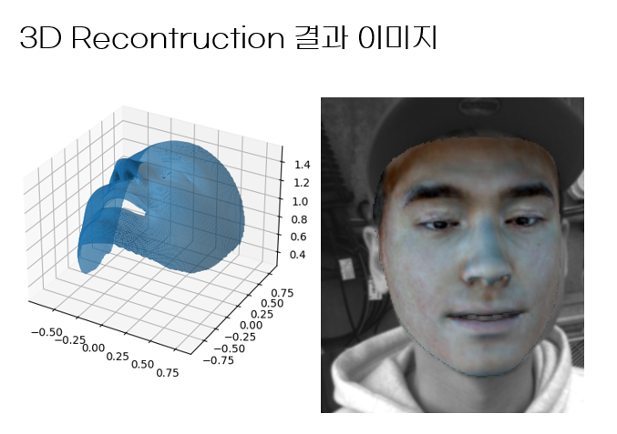
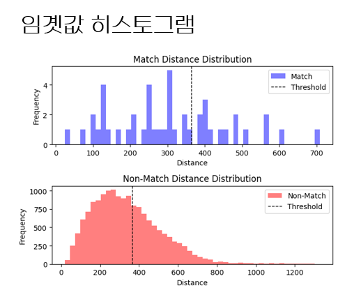

# 2D/3D 안면 이미지 기반 동일인 분류

> 개인 프로젝트 | 2024.03

## 한 줄 요약

CCTV 환경에서 동일인을 식별하기 위해, 전처리/특징 추출/3D Reconstruction 조합의 체계적 실험 설계를 통해 분류 정확도를 40%에서 95%로 향상시킴

---

## 1. 안면 분류 정확도 개선 (40% → 95%)

### 1-1. 문제 정의

- CCTV 환경에서 동선 파악, 재방문 감지 등의 분석 서비스를 위해 동일인 식별 모델을 가정  
- Raw 이미지를 그대로 사용한 초기 분류 정확도가 40%로, 실제 서비스에 적용하기에는 크게 부족함

### 1-2. 가설 수립

- **가설 1 (전처리)**: Raw 이미지에는 배경 노이즈, 얼굴 정렬 불일치 등이 포함되어 있어 모델이 안면 특징에 집중하지 못하는 것이 원인 → Crop, Align, Crop+Align 등 전처리 조합을 적용하면 정확도가 향상될 것이다
- **가설 2 (특징 추출)**: Embedding 기반 비교보다 Landmark 기반 비교가 안면의 기하학적 특징을 더 직접적으로 반영할 것이다
- **가설 3 (공간 정보)**: 2D 이미지만으로는 깊이 정보가 부족하여 각도 변화에 취약할 것이다 → 3D Reconstruction을 도입하면 다양한 각도에서의 분류 정확도가 향상될 것이다

### 1-3. 실행 및 검증

**전처리 × 특징 추출 비교 실험:**
- 전처리 3종(Crop, Align, Crop+Align) × 특징 추출 2종(Embedding, Landmark) = 6가지 조합을 실험
- 2D 이미지 환경에서 Landmark 비교 시 최고 정확도 95% 달성

**얼굴 감지 모델 비교:**
- MTCNN과 FAN을 비교한 결과, FAN이 더 좋은 결과를 보임
- 원인 분석: FAN이 추출하는 Landmark 수가 MTCNN보다 많아, 유클리드 거리 기반 비교에서 비교군이 풍부해져 판별력이 향상된 것으로 분석

**3D Reconstruction 도입:**
- 2D 이미지만으로 공간 정보가 부족한 한계를 보완하기 위해, 3DMM-BFM 기반 3D Reconstruction 도입
- 복원된 Mesh의 정점(Vertex)을 활용하여 유클리드 거리를 측정, 분류 정확도 향상 확인

**임곗값 자동화:**
- 실험마다 최적 임곗값이 변동하는 문제 발생
- 히스토그램 기반 임곗값 자동 계산 방식을 적용하여 일관된 분류 기준 확보

### 1-4. 결과

- 분류 정확도 40% → 95% 달성 (55%p 향상)
- IR 이미지의 다양한 각도에서도 정확한 동일인 식별 가능
- 히스토그램 기반 임곗값 자동화로 실험 및 운영의 일관성 확보
- 체계적 실험 설계(전처리 × 특징 추출 매트릭스)를 통해 각 조합의 성능 차이를 정량적으로 비교하는 방법론을 습득

