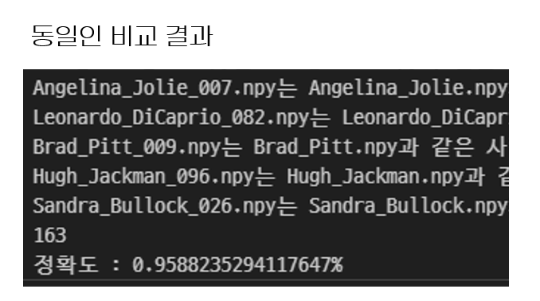
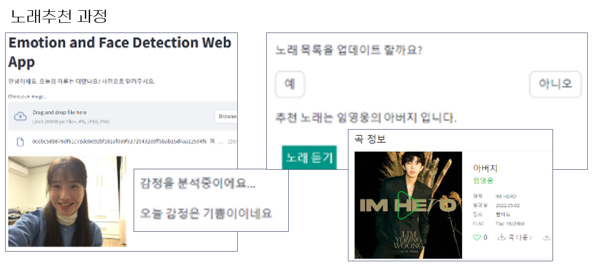

# 안면 감정 분류 기반 음악 추천 서비스

> 팀 프로젝트 | 2024.02

## 한 줄 요약

안면 이미지에서 7가지 감정을 분류하고, 감정에 맞는 음악을 추천하는 서비스를 개발한 프로젝트입니다. 모델 선정 과정에서 ViT의 예상 외 저성능 원인을 분석하여, 데이터 규모에 맞는 모델 선정 기준을 도출

---

## 1. 감정 분류 모델 성능 개선 (31% → 63%)

### 1-1. 문제 정의

- 안면 이미지에서 7가지 감정(anger, anxiety, embarrass, happy, pain, sad, normal)을 분류해야 했으나, 초기 모델의 정확도가 31%로 랜덤 수준(14.3%)보다 약간 높은 수준에 불과

### 1-2. 가설 수립

- **가설 1**: ViT가 최신 아키텍처이므로 CNN 계열(ResNet)보다 높은 성능을 낼 것이다
- **가설 2**: 하이퍼파라미터 튜닝(학습률, optimizer, scheduler 등)으로 동일 모델에서도 상당한 성능 향상이 가능할 것이다

### 1-3. 실행 및 검증

**모델 비교 실험:**

| 모델 | 최저 | 최고 |
|------|------|------|
| ViT | 31.8% | 55.1% |
| ResNet50 | 52.6% | 62.1% |
| ResNet101 | 55.9% | 62.8% |

**예상과 다른 결과 — ViT 저성능 원인 분석:**

가설 1이 기각되었습니다. ViT가 ResNet보다 낮은 성능을 보인 원인을 분석한 결과:
- ViT는 Self-Attention 기반으로, 이미지의 지역적 특징을 추출하는 inductive bias(CNN의 locality, translation equivariance)가 부족
- 이 inductive bias 부족을 보완하려면 대규모 데이터셋이 필요하나, 본 프로젝트의 학습 데이터(train: 5,000)는 ViT가 충분히 학습하기에 부족
- **교훈**: 최신 아키텍처가 항상 최선은 아니며, 데이터 규모에 맞는 모델 선정이 중요

**하이퍼파라미터 튜닝:**
- ResNet101 + epochs: 8, lr: 0.0001, optimizer: Lion, train: 5,000, test: 1,000 조건에서 최고 성능 달성
- Learning curve 분석으로 과적합 여부 확인

### 1-4. 결과

- ResNet101에서 63% 달성 (초기 대비 32%p 향상)
- 데이터 규모에 따른 모델 선정 기준 수립: 소규모 데이터에서는 inductive bias가 강한 CNN 계열이 유리

---

## 2. 감정 기반 음악 추천 서비스 구현

### 2-1. 문제 정의

- 분류된 감정에 맞는 음악을 추천하는 매칭 로직과 사용자 인터페이스가 필요  
- 음악의 감정 분류 기준을 수동으로 레이블링하는 것은 비용이 크고 주관적이라, 자동화된 방식이 필요

### 2-2. 가설 수립

- 음악의 제목에는 곡의 감정적 톤이 반영되어 있을 것이라 판단  
-  BERT 기반 감성 분석으로 곡 제목의 긍정/부정을 분류하면, 완벽하지는 않더라도 감정 매칭의 기본 축으로 사용할 수 있을 것이라는 가설 수립

### 2-3. 실행 및 검증

- 음원 차트 사이트에서 곡 정보를 크롤링
- BERT 모델로 곡 제목을 긍정/부정으로 자동 분류
- 7가지 감정을 긍정(happy, normal 등) / 부정(sad, pain, anger 등)으로 매핑
- 분류된 감정에 맞는 곡을 추천하는 로직 구현
- Streamlit으로 데모 서비스 개발: 사진 업로드 → 감정 분류 → 음악 추천 → 음원 페이지 이동

### 2-4. 결과

- 얼굴 사진 한 장으로 현재 기분에 맞는 음악을 추천받을 수 있는 서비스 완성
- 감정 분류부터 음악 추천까지 End-to-End 파이프라인 구현
- Streamlit 기반 데모로 실제 사용 가능한 형태로 서비스화
- 

